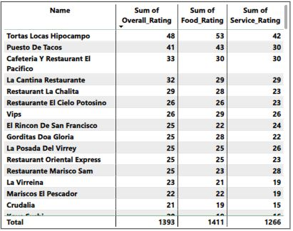

# Mexico Restaurant Rating

---

## Introduction

This is a Power BI project on restaurant rating which contains information about restaurants in "Mexico". A customer survey was carried out in this city in 2012 to collate information about each restaurant, their cuisines, information about their consumers and the preferences of the consumers.

## Problem Statement
1.  What can you learn from the highest rated restaurants? Do consumer preferences have an effect on ratings?
2.  What are the consumer demographics? Does this indicate a bias in the data sample?
3.  Are there any demand & supply gaps that you can exploit in the market?
4.  If you were to invest in a restaurant, which characteristics would you be looking for?

## Skills/Concepts demonstrated:
- Cleaning
- Modelling
- Filter
- DAX
- Quick measures

## Data Cleaning
Empty spaces were replaced with N/A and Age group column was created to get the age range.

## Visualization
The report comprises 2 Pages

## Analysis
## Highest rated restaurant

Tortas Locas Hipocampo is the restaurant with the highest rating. It had the highest food and service rating.

The consumer preferences will affect the rating due to this factors:

Mexican is the most preferred cuisine so the way the consumers would rate mexican food compared to other restaurant that produce non mexican food would be different will be high 

76 of those consumers are single while 7 are married. The other 3 cities had more single consumers than married. In fact, the difference in number between single and married is high. This already points to single people as the group that patronized most restaurants.

## Consumers Demography

86% of the consumers are students, 12% are employed while 2% are unemployed. Students dominated restaurants patronage in the 3 cities used in this dataset in Mexico. This is probably influenced by the proximity of restaurants to schools. The employed probably couldn’t visit restaurants because of their tight schedule. We have to take the age group of the consumers into consideration, 21–25 age group had the most 
 So yes, there is a bias in the data sample
 63% of the consumers used public transport. This resonates with the occupation of the consumers and age group. 27% preferred private car while 11% walked to the restaurant.

 ## Market Demand and Supply
 

More than half of consumer has a budget spend of medium size so their will be demand and supply gap in the market in that the consumer will only be able to patronize restaurants with medium price that suits their budget. Restaurants with higher prices will have low rating.

## Investing Characteristics

Based on the analysis, Tortas Locas Hipocampos had the highest overall rating and so, an investment in this restaurant should prove profitable. An investment in this restaurant will prove to be a smart decision because it meets the demands of the market. Below are some of the factors responsible for Tortas Locas Hipocampos’ rise to the top of the restaurant ratings in Mexico:
- Tortas Locas Hipocampos is located in San Luis Potosi. San Luis Potosi is the city that has most restaurants and most restaurants are located in a closed area.
- Mexican cuisine is the most preferred cuisine among consumers. American cuisine is preferred at a distant second. I recommend that for a profitable restaurant investment in Mexico, Mexican cuisines are a must.
- Tortas Locas Hipocampos do not offer neither alcohol service nor allow smoking. Yet, it is the most rated Restaurant. Apparently, lack of alcohol service or smoking do not have negative effects on the patronage of the restaurant.
- The food price which also infuences purchasing power of the consumer.

  ## Recommedation
- I would recommend that there should be more outlets close to the school since students patronize the most.
- Since more than half of the consumers have medium budget and 27% of the consumers have mlow budget, I would recommend that the price of the meals should be low/medium range
- San Luis Potosi city being the highest in the number of restaurants and consumers, I would recommend investors to target the area since there is likelihood of it to generate more sales.
- Since Tortas Locas Hipocampo restaurant is the highest rated restaurant, investors can target the restaurant. It also offers medium level of pricing, no alcohol service and it is located in San Luis Potosi.
